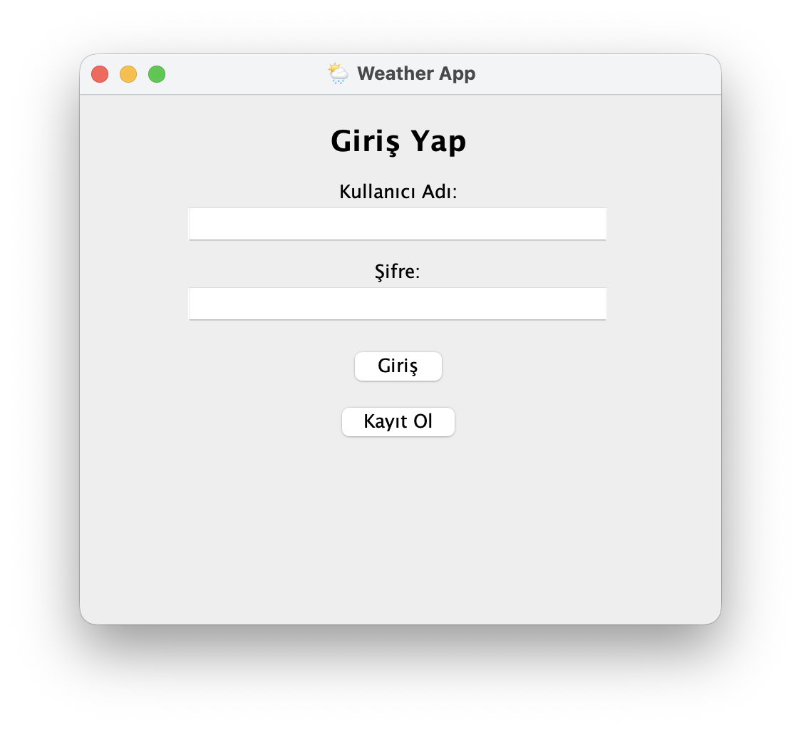
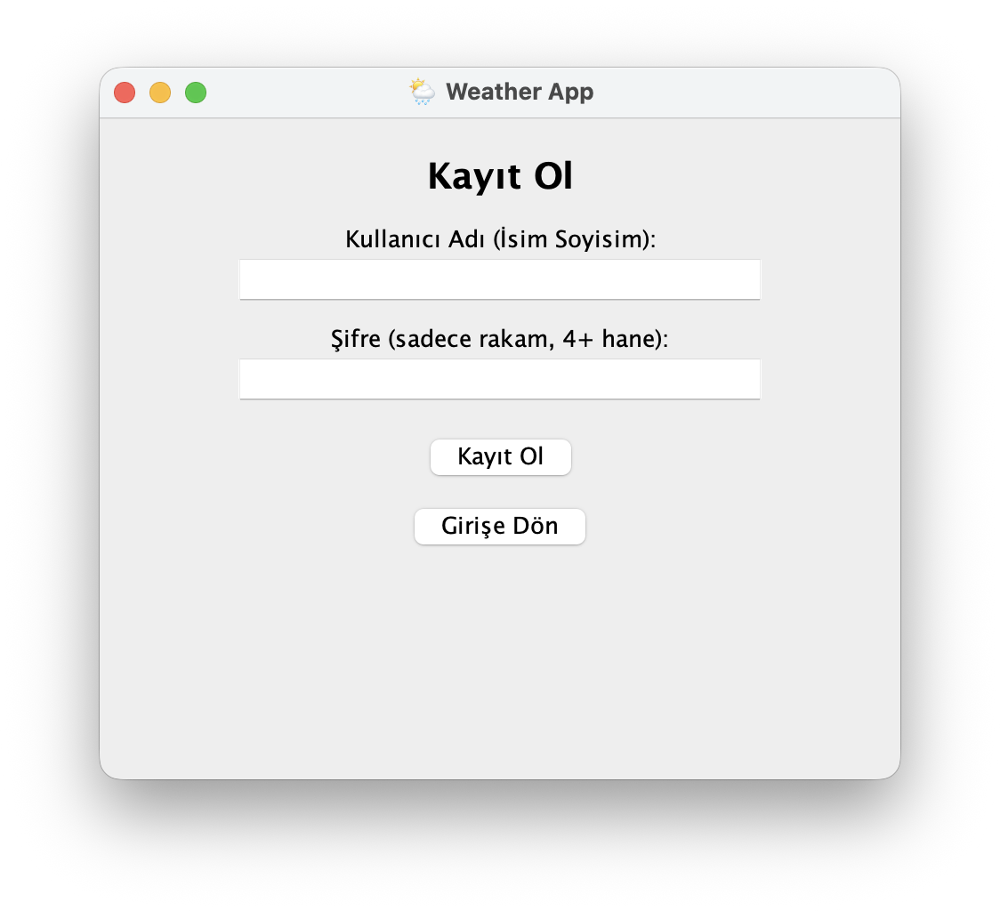

# 🌦️ Hava Durumu Uygulaması

Bu proje, seçilen şehir için güncel hava durumu bilgilerini gösteren basit bir hava durumu uygulamasıdır.  
Uygulama, [OpenWeatherMap API](https://openweathermap.org/api) üzerinden anlık sıcaklık, nem, rüzgar hızı ve hava durumu açıklamasını getirir.

---

## 🚀 Özellikler

- Şehir adına göre hava durumu sorgulama  
- Güncel sıcaklık, nem, rüzgar hızı ve hava açıklamasını gösterme  
- Hava durumuna göre dinamik ikon veya arka plan  
- Hata mesajları (ör. şehir bulunamadı)  
- Basit ve kullanıcı dostu arayüz

---

## 🧰 Kullanılan Teknolojiler

- **Frontend:** HTML, CSS, JavaScript  
- **API:** OpenWeatherMap  
- **Veri Formatı:** JSON  

> Not: Projen farklı bir dilde yazılmışsa (ör. Python, React, Flutter), bu bölümü buna göre düzenleyebilirsin.


## 📸 Uygulama Görselleri






---

## ⚙️ Kurulum

1. Bu projeyi klonla:

   ```bash
   git clone https://github.com/kullaniciadi/hava-durumu.git
   cd hava-durumu
